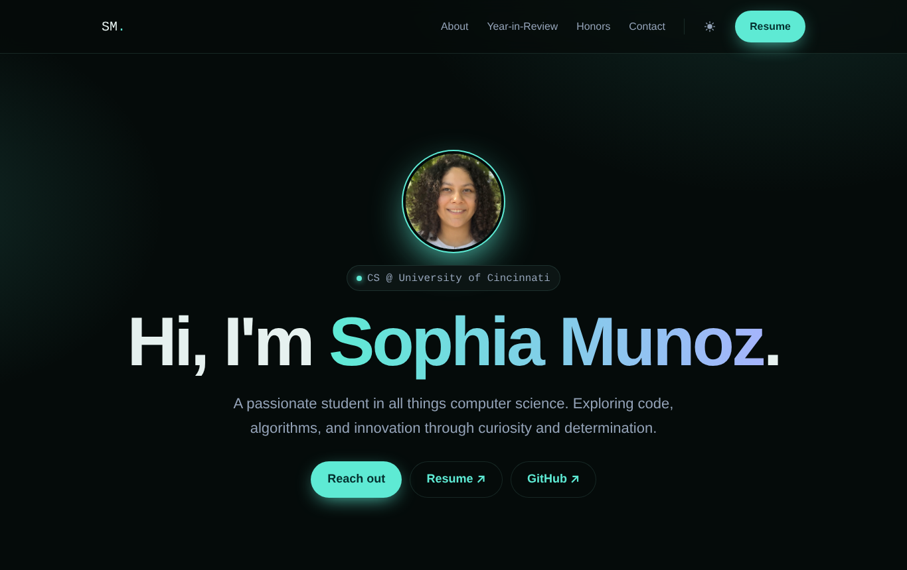

<div align="center">

# Sophia Munoz · Portfolio

**Computer Science student at the University of Cincinnati**

A single-page personal portfolio built from scratch with vanilla HTML, CSS and JavaScript.

[](https://vite.dev/)




</div>

---

## About

This site started as an Honors **Self-Designed Experience**: building a personal website from scratch, without a framework. I began with Jon Duckett's *HTML & CSS: Design and Build Websites*, wireframed the layout by hand, and built it as one page so I could implement lazy loading myself.

It includes:

- **About**: background, languages and a skills list
- **Year-in-Review**: a collapsible timeline of each year of college and co-op
- **Honors Experiences**: project cards for my Honors work
- **Contact**: email and resume links

## Features

- 🌗 **Light / dark mode** saved to `localStorage`
- 🖼️ **Lazy-loaded images** with a blur-up effect, using `IntersectionObserver`
- ✨ **Scroll-reveal animations** that respect `prefers-reduced-motion`
- 📱 **Fully responsive**, using fluid `clamp()` type and a mobile nav menu
- 🎨 **Design tokens** as CSS custom properties, so the whole theme lives in one place
- 🧱 **BEM-style CSS**, with one stylesheet per component

## Getting started

You need [Node.js](https://nodejs.org/) (LTS version).

```bash
git clone https://github.com/munozsophia/Portfolio.git
cd Portfolio
npm install      # first time only
npm run dev      # open the localhost link it prints
```

| Command           | What it does                              |
| ----------------- | ----------------------------------------- |
| `npm run dev`     | Start the local dev server with live reload |
| `npm run build`   | Build the production site into `dist/`    |
| `npm run preview` | Preview the production build locally      |

## Project structure

```
Portfolio/
├── index.html              # all page content
├── public/                 # images, resume.pdf (served as-is)
├── src/
│   ├── main.js             # imports styles + runs the scripts below
│   └── utils/
│       ├── dark-mode.js    # theme toggle
│       ├── lazy-loading.js # swaps in full images when visible
│       ├── mobile-nav.js   # hamburger menu
│       └── reveal.js       # fade-in on scroll
└── styles/
    ├── style.css           # design tokens, base styles
    ├── utils.css           # buttons, layout, animations
    └── components/         # one file per section
```

## Customizing

All colors, font sizes and the corner radius are CSS variables at the top of [`styles/style.css`](styles/style.css). Change `--accent` to retheme the whole site. Light-mode values are in the `.light-mode` block just below.

## Roadmap

- [ ] Projects section
- [ ] Involvement / Interests section
- [ ] Gateway section
- [ ] Deploy to GitHub Pages / Netlify

## Contact

📧 [munozsa@mail.uc.edu](mailto:munozsa@mail.uc.edu) · 🐙 [@munozsophia](https://github.com/munozsophia)